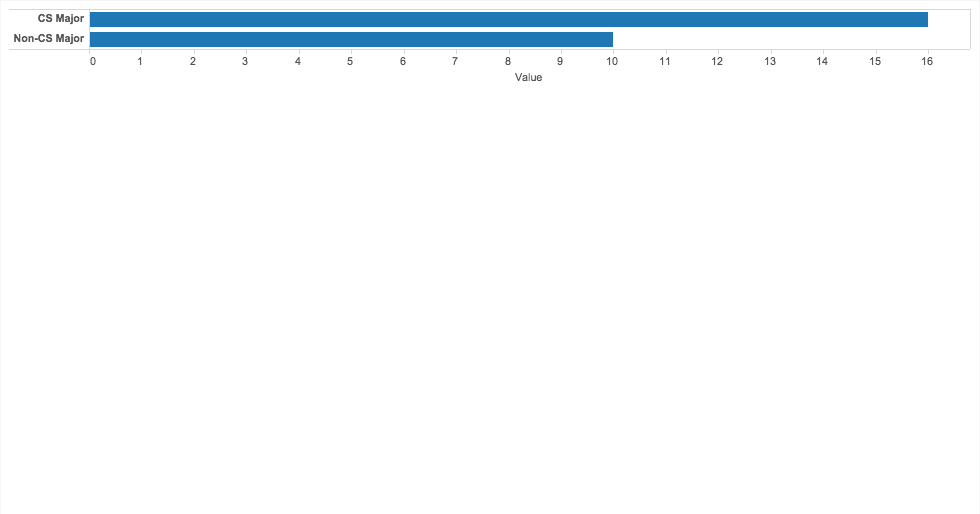
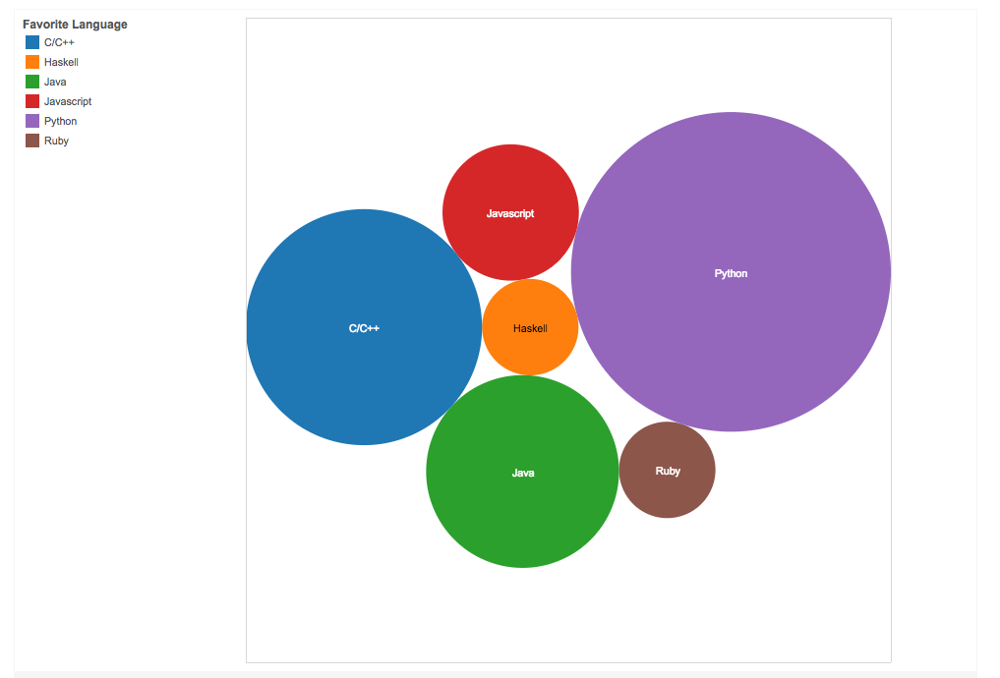

# Tableau Visualization

Tableau is arguably the biggest deal now in terms of data visualization for non-programmers.
Let's pretend you are not a programer. Learn and experience what it is like to make
visualizations using Tableau to answer the same questions about your classmates in our course.

For each of the question, think about what chart you should use to convey your answer and
make your best effort to create something that makes sense to you. There's no right
or wrong. When we meet in the class again, we will set aside time for each team to discuss
and compare the variety of visualization solutions each member has come up with for the
same set of questions. It will be fun!

To include a Tableau visualization in your report, take a screenshot, save it as an image,
put it in the `learning/week2` folder, and replace ``  with
your own image. Please makes sure your screenshot includes the _entire_ Tableau interface
including the controls, widgets ...etc.

# How big the deal Tableau really is?

(write your answer based on the statistics you can find online)

# (Percent of studnetnts that are CS majors)

(As the chart shows, you can see there are 6 more cs majors than non-cs)

# (Whave are the favorite languages)

(The size of the dots represents the popularity of the language among the students in this class)

# (How many sudents submittted before class?)

(Same as below: This is because I graphed this question and the next one together in order to show the amount that submitted after and before class)

# (How many updated their comments after class?)

(ame as above: This is because I graphed this question and the next one together in order to show the amount that submitted after and before class)
