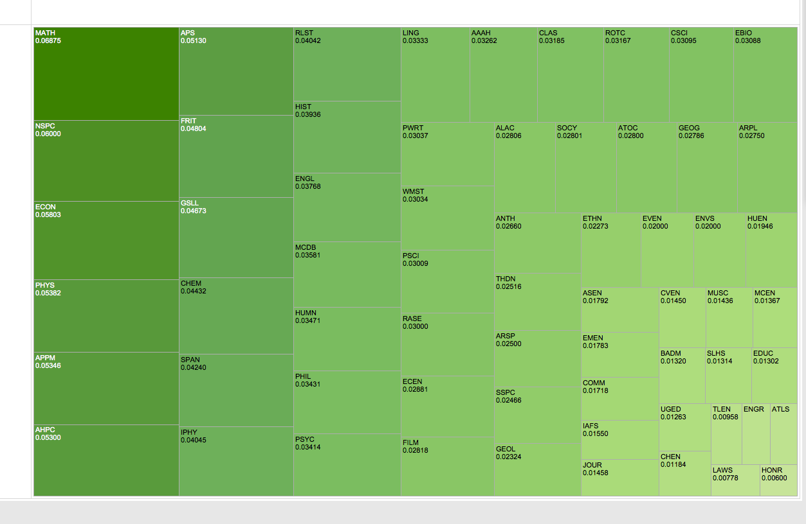
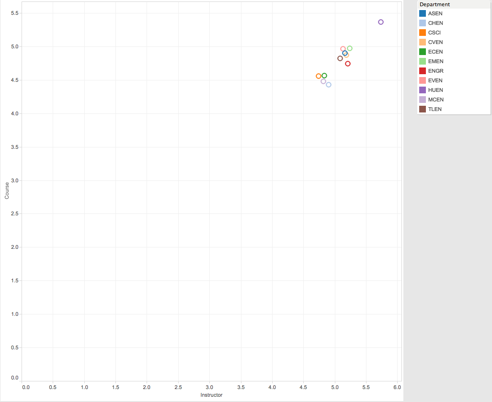
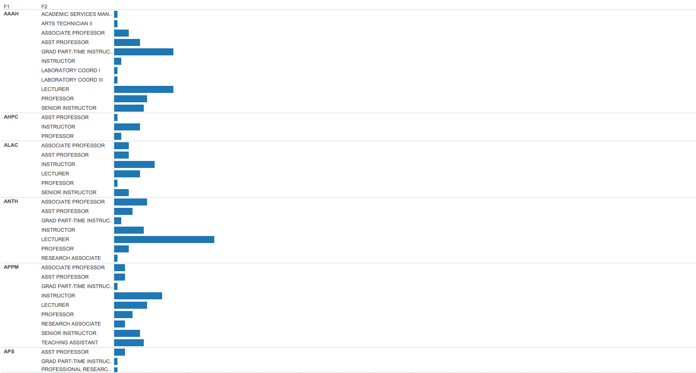
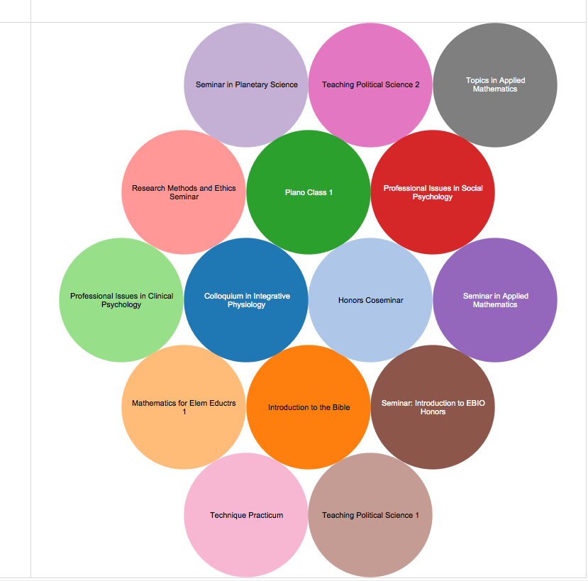
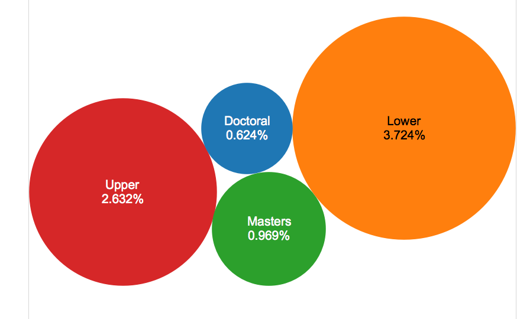

# Visualization

Using Tableau, create visualization for each question in the report. You will
work on this independently just like last week.

To include a Tableau visualization in your report, take a screenshot, save it as an image,
put it in the `learning/week2` folder, and replace ``  with
your own image. Please makes sure your screenshot includes the _entire_ Tableau interface
including the controls, widgets ...etc.

# Import

Data: [fcq.clean.json](https://github.com/bigdatahci2015/book/blob/master/hackathons/fcq/fcq.clean.json)

(a copy of this file is in your book repository already in the directory `hackathons/fcq`)

This dataset is provided to you in the JSON format. Your first task is to figure out
how to transform this JSON file into a format that can be fed into Tableau. As
a junior and senior, you are expected to be able to look around the Internet
to problem solve.

# Question 1: How does retention compare across departments? (by Zach)

You can look in the upper left corner and lower right corner to see the highest and lowest retentions

# Question 2: What is the ranking of Departments within the College of Engineering & Applied Sciences, based on average course rating and average instructor rating? (by Kevin)

The rankings are graphed

# Question 3: What is the distribution of instructor type (e.g., Lecturer, Assistant Professor, Instructor) across departments? (by Karen) 

The height of the bar represents the number of people

# Question 4: What is the easist grade? (by John)

All the classes listed are "easy A"classes

# Question 5: Which course level has the lowest retention?) by (Andrew)

The smallest bubble has the lowest withdrawl rate across divsions. 
  
